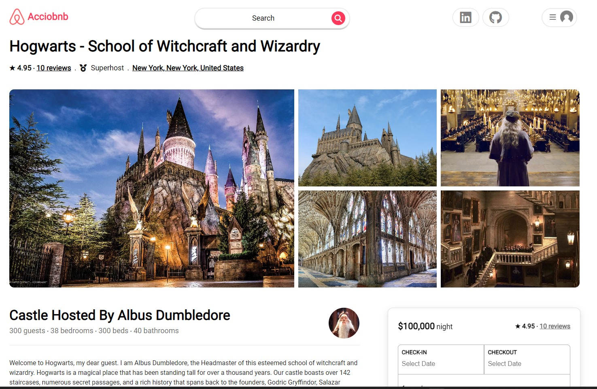
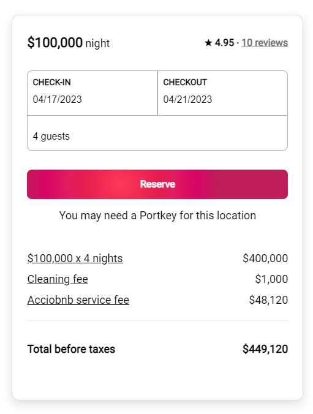
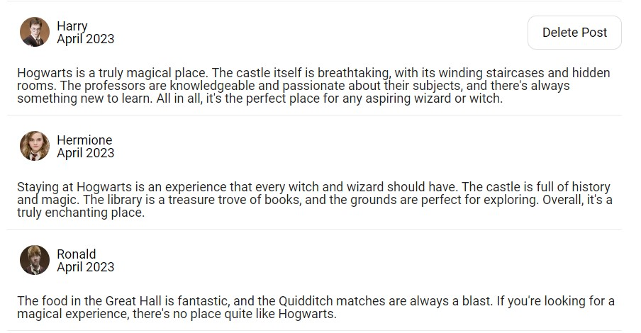

# Welcome to the Magical World of AccioBnB.  

# Introduction
AccioBnB is a clone of AirBnB at the time of creation. AirBnB is a home rental service that allows hosts the ability the rent out their proprierties at certain prices and the user can make reservations to stay at their homes. Users are able to make a reservation and leave reviews on their stay. The technologies implemented in this project include:

* Languages: JavaScript, Ruby, HTML, CSS 
* Frontend and State Management: React and React-Redux
* Database: PostgreSQL
* Hosting: Render 
* Asset Storage: AWS Simple Cloud Stoage (S3) with IAM user permissions.  

# Account Creation
Users are able to explore the site without being signed up. However, they are prompted to sign in when required to do so. Once prompted, users are able to create an account, log in, or login as a demo user. As a demo user, you are able to experience the site's full functionality. Error handling and password protection is also included. The user receives errors if they do not pass certain database and validation checks (handled by the Ruby on Rails backend) and displayed on the login page. 

Notable, the log in and account creation forms are modals. The modals are available in almost portion of the site and use Redux front-end state to determine whether or not they should be shown. The "ui" slice of state keeps track of whether a modal should be showing or not showing. The modal component also keeps track of whether it should be showing in its React state. 


```js 
const uiReducer = (state = {}, action) => {
	const nextState = {...state};

	switch(action.type) {
		case RECEIVE_SIGNUP_MODAL:
			nextState.signUpModal = action.modalState;
			return nextState
		case RECEIVE_LOGIN_MODAL: 
		nextState.logInModal = action.modalState;
			return nextState;
		case RECEIVE_RESERVATION_MODAL:
			nextState.reservationModal = action.modalState
			return nextState
		case RECEIVE_CREATE_REVIEW_MODAL:
			nextState.createReviewModal = action.modalState
			return nextState;
		default: 
			return state; 
	}
}
```

# Listings 
The landing page of AccioBnB displays the listings of the site, includes a search bar, and includes details about each listing. Clicking on a listing redirects the user to the listing's show page. The listing show page includes pictures of the listing, a description, the host, ratings, and more.  It also includes the ability to the make a reservation and leave a comment. 



Notably, the ListingShow page houses information from mutliple database sources in order to display the listing, host, and review information. It utilizes useSelector and useParams hooks to grab infomration. 

```js
const ListingShow = () => {
 const dispatch = useDispatch();
 const sessionUser = useSelector(sessionAction.sessionUser);
 const { listingId } = useParams(); 
 const listing = useSelector(getListing(listingId));
 const hostId = listing ? listing.hostId : null;
 const host = useSelector(state => state.users ? state.users[hostId] : null);
 const users = useSelector(retrieveUsers);
 const reviews = useSelector(getReviews)

```

# Reservations 
Each listing's show page includes the reservation tool. It is critical to making a user reservation and consists of multiple interconnected componenets. You are only able to make a reservation if you are logged in. The user will input the dates in which they would like to stay and the amount of guests that they are bringing. Each listing has a maximum number of guests and the reservation tool does not allow the user to bring more guests than the max amount allowed.  Additionally, users are unable to input dates prior to current date.  Once the user makes a successful reservation. They are able to see their listing in the reservations show page. The reservation show page lists details about each reservation and the user is able to click on their reservation which redirects the user back to that listing.



Notably, the ReservationPicker component has to receive data from its child DatePicker component (the calendar component). The DatePicker component receives the setter functions of the ReservationPicker's state and utilzes those setter functions to set the state of the check in and check out dates that the user selected. This allows three componenets to interact dynamically. This includes the ReservationPicker (the parent reservation component), the first-child date selected component, and second-child DatePicker component. 
```js 
const ReservationPicker = ({chooseCheckInDate, chooseCheckOutDate, chooseShowReservationPicker}) => {
	const [checkInDateText, setCheckInDateText] = useState("") 
	const [checkOutDateText, setCheckOutDateText] = useState("") 

	useEffect(() => {
		if (checkInDateText) {
			updateCheckInDateText(checkInDateText);
			chooseCheckInDate(checkInDateText);
		}

		if (checkOutDateText) {
			updateCheckOutDateText(checkOutDateText);
			chooseCheckOutDate(checkOutDateText);
		}
	}, [checkInDateText, checkOutDateText])

	const updateCheckInDateText = (date) => {
		setCheckInDateText(date);
	}

	const updateCheckOutDateText = (date) => {
		setCheckOutDateText(date);
	}

	const closeReservationPicker = () => {
		chooseShowReservationPicker(false);
	}

	return (
		<div id="dp_container">
			<div id="dp_top_options">
				<div id="dp_top_selectdates">
					Select Dates
				</div>
				<div id="dp_top_checkin_checkout">
					<CheckInCheckOut checkInDate={checkInDateText} checkOutDate={checkOutDateText}/>
				</div>
			</div>
			<div id="dp_top_datepicker_wrapper">
				<DatePicker chooseCheckInDate={updateCheckInDateText} chooseCheckOutDate={updateCheckOutDateText} />
			</div>
			<div id="dp_bottom_row_wrapper">
				<div id="dp_close_button" onClick={closeReservationPicker}>Close</div>
			</div>
			<div id="dp_margin_bottom"> </div>
		</div>
	)
}
```

```js 
const DatePicker = ({chooseCheckInDate, chooseCheckOutDate}) => {
	const [selected, setSelected] = useState({}); 
	let checkInDate = "";
	let checkOutDate = "";
	let datePrompt = <div>Please select your check-in date.</div>

```

# Google Maps 
To Do 

# Reviews 
Users are able to view user reviews on each listing's show page, but are unable to make their own comments. Once logged in, users are able to write reviews of the properties they have "stayed" at. The user can rate the property, and leave a description of their stay. The user can post their review which shows up on the listing's show page. If the user is the author, they are able to delete the review. If they are not the author they are unable to delete the review. They are also unable to delete any reviews if they are not logged in. 



```js
const Reviews = ({users}) => {
	const {listingId} = useParams();
	const dispatch = useDispatch();
	const reviews = useSelector(getReviews);
	let content;

	useEffect(() => {
		dispatch(fetchListingReviews(listingId));
	}, [dispatch, listingId])

	if (reviews.length) {
		let pertinentReviews = [];

		reviews.forEach((review) => {
			let reviewAuthor = users.find((user) => user.id === review.userId)
			if (review.listingId === parseInt(listingId)) {
				pertinentReviews.push(<IndividualReview key={review.id} review={review} user={reviewAuthor} />)
			}
		})
		content = pertinentReviews;
	}

	return ( 
		<div id="reviews_container">
			{content}
		</div>
	)
}
```

# Search Bar 

To Do 

# User Profiles 

To Do 


